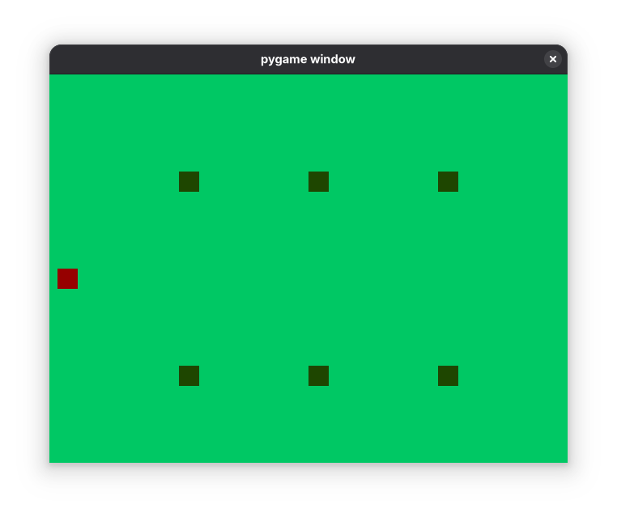

# simple_game_pygame

Simple game written in Python via Pygame



## Setup

Create virtual environment
```
python -m venv venv
```

Activate the virtual environment
```
source venv/bin/activate
```

Install dependencies
```
pip install -r requirements.txt
```

Run the game
```
python main.py
```